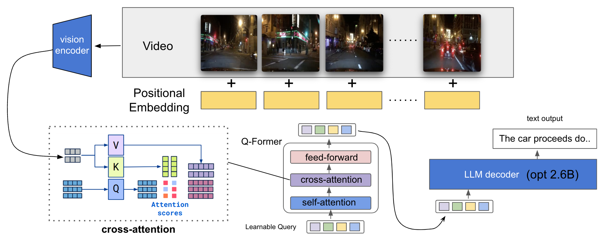

# VideoBLIP: An Extension of the BLIP2 Model for Video Input

This repository contains the source code for the VideoBLIP model. VideoBLIP is a variant of BLIP2, adapted to handle video inputs. In addition, we provide the DeepSpeed launch commands to facilitate multi-node learning.




## Environment Setup

To install the necessary Python modules, execute the following command. We recommend using Python 3.10 and CUDA 11.7.

```shell
pip install -r requirements.txt
``` 

## Installation

```shell
git clone https://github.com/kotarotanahashi/video_blip.git
cd video_blip
pip install .
```


## Training on the BDDX Dataset

BDDX is a dataset containing manual labels for explanatory texts related to driving videos. To train with this dataset, please follow the steps below:

1. Download the dataset from the following link: [BDDX dataset](https://github.com/JinkyuKimUCB/BDD-X-dataset).
2. Once you've downloaded the dataset, navigate to the notebooks directory and run process1.ipynb and process2.ipynb sequentially. Please adjust the data paths in the code to match your own setup.
3. Finally, execute scripts/train_ds.sh.


[](https://www.youtube.com/watch?v=mS7zqT2umb4)

